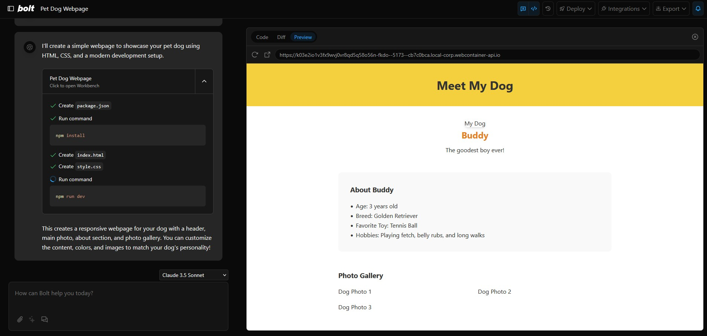

# Bolt: Make a full website using natual langage

Bolt is an AI-powered web development agent that lets you prompt, run, edit, and deploy full-stack applications directly from your browser—no local setup required. If you're here to build your own AI-powered web dev agent using the Bolt open source codebase, [click here to get started!](./CONTRIBUTING.md)

---

## 🚀 What Makes This Version of Bolt Better?

This version of Bolt introduces a suite of powerful features and improvements over the previous branch, making it the most advanced and flexible AI web development environment yet with even more to come. Built from Bolt.new with some of the best features from bolt.diy this is a lightweight and powerful build:

### 🏆 New & Improved Features

- **AI with WebContainer Control**: Bolt gives the AI complete control over the environment—filesystem, node server, package manager, terminal, and browser console—so agents can handle the entire app lifecycle using Webcontaienrs.
- **Faster, More Reliable Snapshots**: Project snapshots are now stored in IndexedDB for improved speed and reliability.
- **Starter Templates for New Projects**: Instantly scaffold new projects with popular starter templates for a faster, smoother start.
- **GitHub Integration**: Connect your workspace to GitHub to import, export, and sync code with your repositories.
- **Download Zipped Project**: You can now download your whole projects source code.
- **One Click Deploy**: One click deploy to Netlify or Vercel.
- **Supabase Integration**: You can now connect your project to a supabase instance with ease.
- **Search Files**: Integrated file search in the file tree.
- **Diff View**: Easily review and understand code changes with a built-in diff viewer.
- **Discuss Mode**: Collaborate and discuss code or project ideas in a dedicated mode.
- **Attach Images**: Add images to your projects and discussions for richer context and documentation.
- **Rewind & Checkpoint**: Roll back your project to previous states or set checkpoints to save your progress.
- **Mobile App Generation with Expo**: Generate and preview mobile apps using Expo, right from your browser.
- **Enhanced UI** Add a glass efffect, editable chat titles.
- **Enhanced Settings** Add settings for clearing all chats and exporting them.
- **Deployment Alert System** Added a Deployment Alert System for when deploying to Vercel, Netlify, etc.
- **Use of Context & Summaries**: Allows the agent to have awearness of the code and its context, while summarizing to save tokens.
- **Local Import**: Allow the import of local projects.

### ✨ Features Coming Soon 
- **Vite 7**: Update Vite to version 7. This will require so refactoring of some code as well.
- **Auto fix errors**: Auto detect and fix errors.
- **Enhanced Prompts**: All prompts still need to be updated.

---

## 💡 Tips and Tricks

- **Use the enhance prompt icon**: Refine your prompt with AI suggestions before submitting.
- **Batch simple instructions**: Combine multiple requests (e.g., change color scheme, add responsiveness, restart dev server) to save time and API credits.

---

## ❓ FAQs

**How can I report issues or request features?**  
Use the [Issues section](https://github.com/dustinwloring1988/bolt.new/issues) to report or request. Please search for existing issues first.

**What frameworks/libraries are supported?**  
Most popular JavaScript frameworks and libraries are supported.

---

## 🤝 Contributing

Want to build your own AI-powered dev tools or contribute to Bolt.new? [See our CONTRIBUTING guide](./CONTRIBUTING.md) for how to get started!
